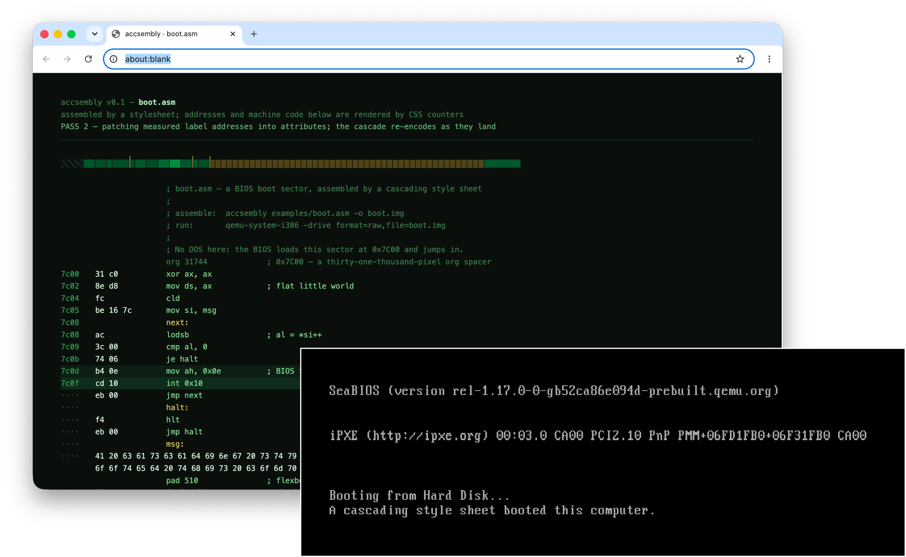

# accsembly

An x86-16 assembler implemented **in HTML and CSS**, executed via Playwright.



There is no compiler code in this repository*. There is a lexer that splits text on
whitespace, and there is one beautiful, 2504-line stylesheet. The stylesheet emits DOS `.COM` binaries.

*: See [Honesty Section](#honesty)

```
$ accsembly examples/hello.asm
  0100  b4 09         mov ah, 9
  0102  ba 0c 01      mov dx, msg
  0105  cd 21         int 0x21
  ...
accsembly: wrote examples/hello.com (50 bytes of x86, computed by a stylesheet)

$ dosbox hello.com
hello from a cascading style sheet!
```

## How

The CLI tokenizes each source line into DOM attributes (`mov ax, 5` becomes
`<i op="mov" a="ax" b="5">`), loads the page in headless Chromium, and reads the
finished machine code back out of the **layout**. Everything in between is CSS.

**The opcode table is a pile of attribute selectors.** An instruction encodes if and
only if a CSS rule matches it. `mov r16, imm16` is a selector. `frobnicate ax` matches
nothing and is therefore a syntax error, as adjudicated by the cascade.

**Operands are decoded with typed `attr()`.** Immediates come in through
`attr(b type(<number>))`. Registers go through a 16-rule "register file" that maps
names to numbers via custom properties.

**Encoding happens in `calc()`.** A ModRM byte is `calc(192 + var(--src) * 8 + var(--dst))`.
Little-endian immediates get split with `mod(var(--imm), 256)` and
`round(down, var(--imm) / 256)`. Two's-complement jump displacements fall out of
CSS `mod()` semantics for free.

**The location counter is literally layout.** Every line renders as an inline-block
whose width in pixels equals its encoded size in bytes, all laid out in one long row,
so an instruction's address *is its x-coordinate*. A label is a zero-width box: its value
is wherever it happens to land. `org 256` is a 256-pixel spacer. The org spacer is
load-bearing.

**Assembly takes two passes.** In pass 1, the CLI reads
label positions off the layout. In pass 2, it copies those numbers into `to` attributes
(a fixup table; plumbing rather than computation), and the cascade reactively re-encodes
every jump and immediate. If you open the page and edit an attribute in devtools,
the program *reassembles live*.

**Bytes leave the page as element widths.** Each emitted byte is an element of width
`1000px + value`, and Playwright reads the binary off the page with
`getBoundingClientRect()`. The hex in the human-readable listing is rendered by
CSS counters through a custom `@counter-style`, because hexadecimal is just a numeral
system and CSS speaks arbitrary numeral systems.

**Strings are 95 attribute selectors.** CSS cannot turn `"H"` into 72, so
`assembler.css` contains the entire printable ASCII table, one rule per character.
This is fine.

## Install & use

```sh
npm install
npm test              # golden-byte tests + executes the output in a toy 8086
node bin/accsembly.js examples/hello.asm
node bin/accsembly.js examples/hello.asm --html listing.html   # keep the assembled page
node bin/accsembly.js examples/hello.asm --show                # watch it assemble
```

### `--show`: watching a stylesheet assemble

`--show` opens a visible browser and runs the real passes at human speed. Nothing
is simulated; the delays are the only theatrical addition.

1. **PASS 1**: the page loads unlinked. Addresses read `····`, and every
   label reference sits at `00 00`, waiting.
2. **PASS 2**: measured label addresses are patched into attributes one line at
   a time, and you watch `ba 00 00` snap to `ba 0c 01` as the cascade re-encodes.
   The strip of boxes at the top is the location counter itself, to scale:
   box width = instruction size, gold ticks mark labels, and the hatched block is `org`.
3. **Pause**: the browser stays open and the CLI waits. The page is the live
   assembler.
   - right-click a source line, e.g. `mov ah, 9`, and pick **Inspect**
   - devtools lands on `<div class="ln lrow" op="mov" a="ah" b="9" at="256" …>`,
     which is the instruction as the assembler sees it
   - double-click the `9` in `b="9"`, type `76`, press Enter, and watch the
     hex column go from `b4 09` to `b4 4c`. There's no script running here, it's
     just CSS selectors recomputing after an attribute change.
   - also fun: changing `a="ah"` to `a="bh"` (register reallocation), any `c="…"`
     cell of a string, or an `op` (setting it to something illegal is an assembly
     error, which the readout will report)
   Edits are mirrored across the three copies of every line (strip, byte bus,
   listing), so what you see is what gets written. Press Enter when done.
4. **READOUT**: pass 1 and the fixups rerun from fresh measurements (in case
   your edits resized instructions and moved every label), then each line's
   bytes are pulled off the layout (highlighted as they go) and written to
   disk, including any edits you made.

Run the output in DOSBox, or in the bundled test interpreter:

```sh
node test/run-com.js examples/hello.com
```

## The language

Real x86-16, targeting flat `.COM` binaries (load address `0x100`).

| | |
|---|---|
| moves | `mov` between r16/r8, immediates, labels, `[mem]` (both directions), and segment registers (register *and* memory forms), including the accumulator short forms (`A0–A3`, `B8+r`), plus `mov byte/word [mem], imm` (`C6/C7`), just like nasm |
| alu | `add or adc sbb and sub xor cmp`, 16- and 8-bit, reg/reg, reg/imm (with `04/05`-family accumulator forms), reg/mem, mem/reg, and `byte/word [mem], imm` (`80/81/83`, sign-optimized) |
| bit-twiddling | `shl sal shr sar rol ror rcl rcr` by `1`, `cl`, or imm8, on registers or `byte/word [mem]` · `test` (reg/imm/acc/mem, both operand orders) · `not neg mul imul div idiv` (16 & 8-bit, reg or mem) · `xchg` (incl. one-byte `90+r` ax forms and memory) |
| control | the full `7x` conditional row (`jo` … `jg` + aliases), `jcxz`, `loop/loope/loopne` (rel8) · `jmp` (rel8, auto-widening to rel16; see relaxation below, or `jmp short/near` to pin it) · `call` (rel16) · indirect `call/jmp reg`, `call/jmp [mem]`, `call/jmp far [mem]` (`FF /2..(/5)`) · far direct `call/jmp seg:off` (`9A`/`EA`) · `ret imm16`, `retf`, `retf imm16` |
| strings | `movs/cmps/stos/lods/scas` (b/w) with `rep/repe/repne` prefixes |
| stack & flags | `inc dec` r16/r8/`byte/word [mem]` · `push pop` r16, sregs, `word [mem]` · `pushf popf lahf sahf clc stc cmc cld std cli sti` |
| system | `int imm8` · `int3` · `into` · `iret` · `hlt` · `wait` · `xlat/xlatb` · `cbw cwd` · `ret` · `nop` · `in al/ax, imm8/dx` · `out imm8/dx, al/ax` · BCD: `aaa aas aam aad daa das` (with optional base) · `lea les lds` · `lock` prefix · segment overrides `[es:bx+2]` (emitted in nasm's order, kept even when redundant, just like nasm) |
| data | `db "string", 'c', 13` · `dw 1234, label` (labels become absolute addresses) |
| directives | `org n` (first line; defaults to 256) · `pad n` (fill with zeros to offset n; the fill size is solved by flexbox, see below) · `NAME equ value` (constants, resolved by layout: the equ's box is `value` pixels wide) |

`[mem]` is any 8086 addressing mode: `[bx]`, `[bp]`, `[si]`, `[di]`,
`[bx+si]`, `[bx+di]`, `[bp+si]`, `[bp+di]`, a direct `[label]` or `[1234]`,
each optionally with a displacement: `[bx+2]`, `[si-2]`, `[label+4]`,
`[bx+si+8]`. Written in canonical order (base, index, displacement). The ModRM
table lives in `assembler.css` as attribute selectors. Two constraints
inherited from the wiring: one memory operand per instruction (x86 agrees),
and one symbol reference per line (there is a single `to` attribute to carry
it).

House rules:

- **Numbers**: decimal, `0x` hex (up to 16 bits), or `'c'` char literals. CSS
  cannot parse `"0x7c"` out of an attribute, so the lexer deals hex out as
  digit attributes and the selectors do the place-value arithmetic. There
  are three role-tagged hex wires per line: first operand (`ha1–4`),
  second operand (`hb1–4`), and memory displacement (`hd1–4`), so
  `add word [bx+0x10], 0x1234` works. 192 selectors were harmed in the
  making. One char literal per line (a single `c` wire). Fixups ride
  role-tagged wires too (`toa/tob/tod`), so `[msg+5]` next to a literal
  immediate never crosstalks. (`org`/`pad` arguments stay decimal.)
- Labels: `name:` on its own line or before an instruction; forward and backward
  references both work (that's what pass 2 is for).
- Comments with `;`. Strings are printable ASCII, no escapes; use numeric bytes
  (`13, 10, 36`) like your forebears.
- Conditional jumps are rel8 (±127 bytes; the 8086 has no wider form, and the
  CLI tells you when you've exceeded a `je`'s attention span). Plain `jmp`
  widens itself.

## The optimizer

The stylesheet picks the same optimal encodings `nasm -Ox` does:

- **Sign-extended immediates**: `add cx, 5` emits `83 c1 05`, not `81 c1 05 00`.
  "Fits in a signed byte" is computed with `clamp(0, 128 - max(s, -1 - s), 1)`.
  CSS has no comparisons, but a clamp on integers is a step function.
- **Compressed displacements**: `[bx]` needs no displacement bytes (`8b 07`),
  `[bx+5]` takes one, `[bx+300]` takes two, and `[bp]` pays the one-byte tax
  the ModRM table demands. Conditional bytes are killed by mixing `-20000`
  into their value: negative width, zero pixels, no byte.
- **Accumulator vs 83**: `add ax, 5` is `83 c0 05`, while `add ax, 300` is
  `05 2c 01`. The two encodings are *linearly interpolated* by the fits-flag:
  `--b1: calc((var(--ext) - 187) * (1 - fits) + 131 * fits)`.
- **Jump relaxation**: a `jmp`'s width depends on its distance, and every
  distance depends on widths. The CLI re-renders and re-measures until the
  layout stops moving. Assembly as a fixed point of reflow.

## Validation: differential testing against NASM

`test/differential.js` generates hundreds of random programs from the full
grammar above (every instruction form, addressing mode, hex/char literal,
`equ`, jumps, data), feeds the **same source text** to the stylesheet and to
`nasm -f bin -Ox` (full size optimization), and requires **byte-for-byte
identical binaries**. No syntax adaptations, no exclusions. Fixed fixtures
cover `examples/boot.asm` against its nasm `times`-directive twin (all 512
bytes), jump relaxation, and `equ`.

```sh
npm test               # unit tests + 60 differential programs
npm run test:diff      # 400 differential programs
node test/differential.js 1000 <seed>   # go wild, reproducibly
```

If nasm isn't installed the differential step skips itself
(`brew install nasm`).

## The boot sector

`examples/boot.asm` is a real BIOS boot sector: no DOS, no OS, just the firmware
loading it at `0x7C00` and jumping in. `org 31744` is a thirty-one-thousand-pixel
spacer. The 464 bytes of zero padding before the `0xAA55` signature come from
`pad 510`, whose size is computed by **flexbox**: the strip wraps
`[org … pad]` in a flex row whose width is `calc(org + 510)` pixels, every
instruction is `flex: none`, and the pad line is the lone `flex: 1` item. The
layout engine solves `510 - code` and the CLI reads the answer off
`getBoundingClientRect()`.

```sh
node bin/accsembly.js examples/boot.asm -o boot.img
qemu-system-i386 -drive format=raw,file=boot.img
# ... "A cascading style sheet booted this computer."
```

## The bootstrap (`--boot`)

The Node CLI used to do three jobs. Two of them were computation
(tokenizing; deciding fixups and convergence). Those are now performed by
**DOS programs that this assembler itself assembled**:

- `boot/lexer.asm` (~2,400 lines of 8086) tokenizes source text into the
  DOM-attribute records. Its input is appended to its own binary image; its
  output is printed one `int 0x21` character at a time.
- `boot/linker.asm` builds the symbol table from measured boxes, resolves
  every reference, performs rel8 range diagnostics, and decides when the
  jmp-relaxation reflow loop has converged.
- `boot/writer.asm` validates the measured widths (`1000..1255`), extracts
  the bytes, emits the flexbox-solved `pad` zeros, and reports lines no CSS
  rule matched.

```sh
node test/bootstrap.js                            # assemble and test lexer,
                                                  # linker, and writer:
                                                  # parity + the fixed point
                                                  # --- takes a bit of time
                                                  # for obvious reasons

node bin/accsembly.js examples/hello.asm --boot   # nothing computes but CSS
                                                  # and CSS-assembled x86
```

`node test/bootstrap.js` runs the ritual: stage 0 assembles the three
programs with the JS chain; the bootstrapped chain must then produce
byte-identical output on every example, on random programs from the full
grammar, and, as the fixed point, **on its own three source files, using
itself**. `lexer.com` tokenizes `lexer.asm` inside the bundled 8086
interpreter, the stylesheet assembles it, and the output equals the binary
doing the work. Delete `src/lexer.js` from your mental model; it is now
bootstrap equipment, like the wooden scaffolding around a cathedral.
(Obligatory citation: Ken Thompson, *Reflections on Trusting Trust*. The
stylesheet now assembles the lexer that feeds the stylesheet, and you
cannot prove the cascade hasn't hidden anything in it.)

The interpreter is not part of the trusted chain either: `lexer.com` is a
real DOS program. Run it under DOSBox if you distrust JavaScript.

## <a name="honesty"></a> Honesty section: What counts as "in CSS" here

In the default chain the Node CLI does three
jobs: lexing (token shape only), fixup plumbing (copying measured numbers
into attributes), and I/O. With `--boot`, the first two are done by
CSS-assembled x86 running on the bundled interpreter, and Node is reduced
to job three plus framing: it runs the CPU, splices lexer records into
fixed HTML templates verbatim, measures rectangles, copies the linker's
patch frames into attributes, and writes the writer's byte frames to disk.
It parses framing, never content.

Opcode selection, register allocation, ModRM arithmetic, address assignment,
symbol values, jump displacement math, endianness, and hex formatting all happen
inside a CSS engine. `test/run-com.js` is a ~100-line 8086 interpreter used only
by the test suite to prove the binaries actually run.

## Why

`calc()` is right there, yet everyone keeps writing compilers in
languages.
